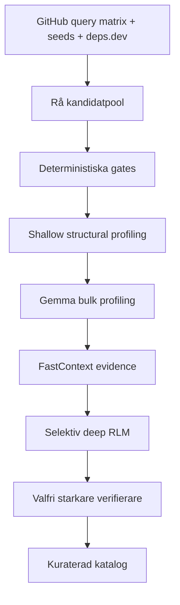
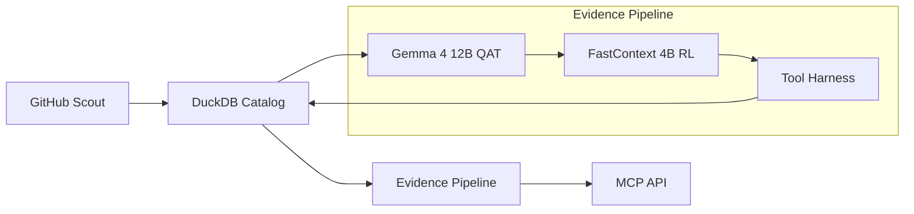

# Design för Curated Repos med On-Demand RLM

## Executive summary

Den starkaste, enklaste och mest validerbara riktningen är att bygga ett **kuraterat repo-bibliotek med on-demand RLM-inspektion**, där **GitHub-scouting** och **deterministiska filter** skapar en kandidatpool, **Gemma‑4‑12B QAT** gör billig bulkprofilering, **FastContext‑4B‑RL** hittar fil- och radspecifik evidens inne i utvalda repoer, och ett **begränsat RLM-lager** sammanfattar återanvändbarhet, kopplingar och anpassningsbehov för den aktuella uppgiften. Detta ligger nära hur FastContext är tänkt att användas: som en separat “exploration subagent” som avlastar huvudagentens kontext och returnerar kompakta fil/rad-citeringar, inte som allmän kodgenerator. Samtidigt passar Gemma‑4‑12B QAT väl för lokal körning på 16 GB GPU-minne: Google anger cirka **6,7 GB** för Q4_0, medan Gemma 4 26B A4B kräver cirka **14,4 GB** och 31B cirka **17,5 GB**, vilket gör 12B betydligt mer praktisk på en RTX 5070 Ti med 16 GB VRAM. citeturn17view0turn17view1turn5search2turn18view3turn21view0

Det arkitektoniska nyckelbeslutet är att **inte** försöka bygga en fullständig, förhandsutvunnen komponentkatalog över alla repoer. GitHubs egen repositoriesökning kan filtrera på namn, beskrivning, topics, README, språk, stjärnor, push-datum, template, mirror, offentlig/privat och archived-status, men den kan inte användas för att söka godtyckligt innehåll i hela källträdet på repo-nivå utöver `in:readme`; för djupare källinnehåll krävs kodsökning eller lokal kloning. Därför bör designen vara en tratt: **bred kandidatinsamlare först, bevisdriven djupinspektion sist**. citeturn3view0turn0search14turn0search1turn0search2

För kandidatupptäckt bör systemet använda tre källor samtidigt: en **GitHub query matrix** över capabilities och repo-typer, **seed expansion** från redan bra projekt/organisationer/topics, samt **deps.dev** för att gå från viktiga npm-paket till associerade source repositories, package versions och i vissa fall attesteringar och commit-länkar. deps.dev:s v3-API är stabilt, uttryckligen cachebart och exponerar både package- och project-data, inklusive GitHub-projektmetadata samt mappningar mellan projekt och package versions. citeturn13view0turn13view3turn11search6

För runtime bör den första versionen hålla sig enkel: **LM Studio som lokal OpenAI-kompatibel server**, officiell **Gemma 4 12B QAT GGUF** som huvudmodell, och **FastContext 4B RL via community-GGUF** i LM Studio eller llama.cpp när det fungerar stabilt. LM Studio kan exponera OpenAI-kompatibla endpoints och låter dig spara per-modellinställningar som GPU offload, kontextstorlek och Flash Attention. Samtidigt är FastContexts officiella snabbstart riktad mot en OpenAI-kompatibel server som SGLang med Qwen-verktygsparser, vilket är ett starkt skäl att låta **Python-harnessen äga verktygsloopen** i stället för att förlita sig på “native tool calling” i LM Studio för FastContext. citeturn7search1turn7search7turn7search0turn17view1turn19view1turn8search2

För POC rekommenderas fyra tydliga milstolpar: **500 råa kandidatrepoer**, **100 kvalificerade repoer**, **30 evidensgranskade repoer**, och **ett MCP-verktyg** som ett AI-kodningsagent kan använda via flödet `find_reusable_code → get_source_bundle → integrate`. Det minimerar komplexitet, håller all känslig data lokal, och följer den mest kostnadseffektiva principen som både FastContext och RLM-litteraturen pekar mot: **billig lokal utforskning, dyrt resonemang endast där evidens redan finns**. citeturn17view0turn17view1turn9search1turn9search6turn9search21

## Mål, avgränsning och användarflöde

Målet är inte att bygga “en bättre GitHub-sökning”, utan att bygga ett **återanvändningslager för AI-kodningsagenter**. Agenten ska kunna formulera ett arbetsbehov i naturligt språk, få förslag på **några få högvärdiga repoer**, hämta ett **källkodsbunt** med filvägar, beroenden och commit-SHA, och sedan integrera eller adaptera lösningen i det aktuella projektet. MCP passar väl som gränssnitt eftersom det är byggt för att ge AI-applikationer verktyg och extern kontext; LM Studio kan dessutom ansluta till MCP-servrar lokalt. citeturn7search2turn7search1

Det rekommenderade kärnflödet är:

```text
AI-kodningsagent
   │
   ├── find_reusable_code(task, project_path)
   │       ↓
   │   lokal katalog + projektdetektion
   │       ↓
   │   shortlist 3–5 repoer
   │       ↓
   │   FastContext + Gemma/RLM på de bästa kandidaterna
   │
   └── get_source_bundle(candidate_id, task_signature)
           ↓
       filer + beroenden + commit-SHA + anpassningsråd
           ↓
       integrate
```

Detta flöde är medvetet smalare än ett traditionellt “repo finder”-verktyg. Syftet är att minska antalet beslut som agenten måste ta själv. FastContext är särskilt relevant här eftersom dess kontrakt är just att returnera **kompakt, jordad evidens** i form av fil- och radintervall, vilket sedan kan ligga till grund för huvudresonemanget. citeturn17view0turn17view1

En minimal MCP-yta bör bestå av tre verktyg:

| Verktyg | Syfte |
|---|---|
| `find_reusable_code(task, project_path, max_repos=3)` | Hitta kompatibla implementationer och returnera `task_signature` |
| `get_source_bundle(candidate_id, task_signature)` | Hämta exakta filer, beroenden, commit-SHA och noter för ursprungsuppgiften |
| `record_reuse_outcome(candidate_id, task_signature, outcome)` | Mata tillbaka utfall till rankningen per ursprungsuppgift |

Det viktiga för användbarheten är att **svaren är handlingsbara**. Resultatet ska inte vara “denna repo verkar bra”, utan snarare: *använd `components/data-table.tsx`, `hooks/use-table.ts`, lägg till `@tanstack/react-table`, och var uppmärksam på att server actions är app-specifika*.

## Kandidatupptäckt och urvalstratt

Upptäcktslagret ska vara **offline och periodiskt**, inte per användarfråga. GitHub rekommenderar autentiserad API-användning, seriell eller köad förfrågningshantering för att undvika sekundära rate limits, och både REST och GraphQL har tydliga primära och sekundära begränsningar. REST har separata buckets för search, och GraphQL använder poängbaserade limits. Därför bör scoutingen vara ett planerat jobb med cache, inte en live-query varje gång agenten frågar efter återanvändbar kod. citeturn0search1turn0search5turn0search14turn0search2turn0search6

### Query matrix

GitHubs repositoriesökning stödjer precis de kvalificerare som behövs för kandidatgenerering: `in:name`, `in:description`, `in:topics`, `in:readme`, `user`, `org`, `stars`, `forks`, `pushed`, `language`, `topic`, `is:public`, `mirror`, `template` och `archived`. När `in` saknas söker GitHub bara i namn, beskrivning och topics; `in:readme` måste alltså läggas till för capability-sökning via README-text. Dessutom kan repoer filtreras på `archived:false` och `is:public`. citeturn3view0

En praktisk querybank bör organiseras som en matris över:

- capability, exempelvis `data-table`, `command-palette`, `auth`, `dashboard-shell`, `file-upload`
- repo-typ, exempelvis `library`, `design_system`, `reference_application`, `starter`
- star-band, exempelvis `0..20`, `20..100`, `100..1000`, `>=1000`
- stack, exempelvis `language:TypeScript`, `topic:nextjs`, `topic:react`
- recency, via `pushed:>=2025-12-21`

Exempel:

```text
"command palette" in:name,description,topics,readme
language:TypeScript
topic:nextjs
archived:false
is:public
pushed:>=2025-12-21
stars:20..500
```

Cutoffen **2025‑12‑21** följer direkt av dagens datum 2026‑06‑21 och kravet “senaste sex månaderna”.

### Seed expansion och deps.dev

GitHub-querybanken ensam ger bredd men inte alltid hög recall för ekosystemets viktigaste repoer. Därför bör ett andra flöde utgå från **seeds**: organisationer, repoer eller npm-paket som redan visat sig vara användbara. Här är deps.dev särskilt nyttigt. API:t kan ge dig project-data för GitHub/GitLab/Bitbucket, package-versioner, dependency graph-data och mappningar mellan **projekt** och **package versions**. För projektmappningar kan deps.dev dessutom returnera relationstyp, proveniens och för vissa package-ekosystem även källa till commit/provenance. v3-dokumentationen säger uttryckligen att klienter får cacha API-data. citeturn13view0turn13view3

Det gör följande seed-strategi robust:

1. börja från kända npm-paket eller UI-bibliotek
2. slå upp associerat source project via deps.dev
3. expandera till syskonrepoer i samma organisation
4. lägg till relaterade topics och README-termer i GitHub querybanken
5. lagra alla kandidater även om de initialt rankas lågt

### Deterministiska gates

Före all modellprofilering bör varje kandidat passera hårda, billiga filter:

| Gate | Regel |
|---|---|
| Synlighet | `is:public` |
| Arkivstatus | `archived:false` |
| Färskhet | `pushed_at >= 2025-12-21` |
| Spegling | `mirror:false` om möjligt |
| Stack | tydlig evidens för TS/JS/React/Next.js |
| Minimikvalitet | inte docs-only, inte tomt repo, inte binärdump |

GitHub dokumenterar både `pushed`-qualifiern och archived/public-filter. GitHubs språkstatistik bestäms av Linguist och bör därför användas som en **signal**, inte som hård sanning; stackdetektionen bör kompletteras med `package.json`, `next.config.*`, `tsconfig.*`, workspace-filer och katalogstruktur. citeturn3view0turn1search14

### Flerstegs-tratt

Den rekommenderade tratten är:



Varje steg ska minska kostnaden per kandidat:

| Steg | Typ | Kostnad | Resultat |
|---|---|---:|---|
| Metadata | API | låg | rå kandidatmängd |
| Struktur | API/local parse | låg | repo-card |
| Gemma bulk | lokal LLM | låg–medel | capability-profil |
| FastContext evidence | lokal explorer | medel | fil/rad-evidens |
| Deep RLM | lokal Gemma + verktyg | medel | återanvändbarhetsbedömning |
| Stark verifierare | valfri | hög | adjudikering av osäkra fall |

Det avgörande här är att **FastContext kommer efter Gemmabulkprofilering**, inte före. FastContext är bäst på att hitta *var* något finns när du redan har en hypotes om *vad* du letar efter. FastContexts officiella design är exakt detta: huvudagenten skickar en naturlig språkfråga, FastContext utforskar repo med `READ`, `GLOB`, `GREP` och returnerar kompakta fil/rad-citeringar. Modellen är tränad genom SFT och RL för bred förstahandssökning, multitur-evidensinsamling och precis citeringsgenerering. citeturn17view0turn17view1turn4search4

## Arkitektur, modeller och runtime

### Rekommenderad arkitektur

Systemet bör delas i fyra lager:



**GitHub Scout** hänvisar till offline discovery-jobben.  
**DuckDB Catalog** lagrar repoer, snapshots, repository cards, assets och utfall.  
**Evidence Pipeline** är den lokala intelligensen.  
**MCP API** är det enda yttre gränssnittet för AI-agenten.

Valet av **DuckDB** är rationellt för en enanvändar-POC: DuckDB är en in-process OLAP-databas, snabb, filbaserad, ACID-kompatibel och har inbyggt JSON-stöd via `json`-extension. För den här typen av lokal katalog, logg och analyslager ger DuckDB låg driftkomplexitet jämfört med Postgres + kö + separat indexering. citeturn12search1turn12search0turn12search4

### Modellval för RTX 5070 Ti

För din hårdvara bör modellen hållas till två kärnkomponenter:

| Roll | Rekommendation | Varför |
|---|---|---|
| Explorer | `microsoft/FastContext-1.0-4B-RL` via GGUF i LM Studio/llama.cpp | specialtränad för repo-utforskning med READ/GLOB/GREP |
| Huvudmodell | `google/gemma-4-12B-it-qat-q4_0-gguf` | ryms rimligt i 16 GB, stark för resonemang/kod/agentic workflows |

Google anger officiellt ungefär **6,7 GB** för Gemma 4 12B Q4_0, **14,4 GB** för 26B A4B och **17,5 GB** för 31B. Samtidigt beskriver Google 12B som “laptop ready” och liten nog att köras lokalt med 16 GB VRAM eller unified memory. Det gör 12B till den bästa kompromissen för ett lokalt RLM-lager på din maskin. FastContext 4B-RL är dessutom explicit en 4B-explorer snarare än en allmän resonemangsmodell, vilket passar rollen som billig fil-lokaliserare. citeturn5search2turn18view3turn17view1

Gemma 4 12B QAT har också de rätta produktmässiga egenskaperna för den här rollen: officiell GGUF-distribution, upp till 256K kontext, konfigurerbara thinking modes, system prompt-stöd, native function calling och tydlig positionering för kodning, resonemang och agentiska arbetsflöden. Googles dokumentation anger dessutom att 12B är “Unified”, alltså encoder-fri för multimodal input, men detta är sekundärt för POC:n eftersom fokus initialt är text och kod. citeturn21view0turn5search6turn6view3

### Varför inte större modeller först

Gemma 26B A4B och 31B är relevanta alternativ, men de ökar komplexiteten märkbart. 26B A4B är snabbare än en tät modell genom MoE-strukturen och har bättre benchmarkresultat än 12B, medan 31B är starkast i familjen på bland annat LiveCodeBench v6 och MMLU Pro. Men minneskraven flyttar dem från “robust vardagsmodell” till “gränsfall eller offload-scenario” på 16 GB VRAM. För en första intern POC är detta sällan rätt tradeoff. citeturn6view2turn6view3turn5search2

Qwen3.6‑35B‑A3B är också intressant som alternativ i teorin, men det tillför ytterligare ett modellspår, annan instruktionsstil och större driftkomplexitet utan att vara nödvändigt för första valideringen. Kärnfrågan i POC:n är främst **pipelinekvalitet**, inte maximal benchmarkpoäng.

### Runtime och harness

Den enklaste praktiska driftlösningen är:

- **LM Studio** som lokal modellserver
- **OpenAI-kompatibla endpoints** som gemensamt klientgränssnitt
- **GGUF-format** för Gemma och FastContext
- **Python-harness** som äger verktyg, köer, cache, sandboxing och protokoll

LM Studio stöder lokal API-server på `localhost`, inklusive OpenAI-kompatibla endpoints, och låter dig spara per-modell-defaults för GPU offload, contexts och Flash Attention. llama.cpp erbjuder också en OpenAI-kompatibel HTTP-server och stöd för schema-konstruerad JSON-output. citeturn7search1turn7search7turn7search0turn8search2turn8search6

FastContexts officiella quick start utgår däremot från en OpenAI-kompatibel server som **SGLang** med Qwen tool-call parser. Community-GGUF-konverteringar, exempelvis från **mitkox**, gör modellen lätt att köra i llama.cpp och LM Studio, men de är just konverteringar och inte Microsofts officiella serverväg. Därför bör du behandla FastContext som en **textmodell bakom en strikt Python-loop**, inte som ett fritt verktygssamtalande AI-system. Det ger högre robusthet. citeturn17view1turn19view1turn20search6turn4search5

Rekommenderade verktygsgränssnitt i harnessen:

```text
github_search(query, page)
get_repo_metadata(repo)
get_repo_tree(repo, commit)
read_file(repo, commit, path, start, end)
grep_repo(repo, commit, pattern, scope)
parse_package_json(repo, commit, path)
rank_candidates(task, project_profile)
store_profile(...)
store_evidence(...)
```

Och för FastContext:

```text
READ(path, start_line, end_line)
GLOB(pattern)
GREP(regex, scope)
```

### Säker sandboxing

RLM-mönstret är kraftfullt men kräver disciplin. Den officiella RLM-koden beskriver att standardmiljön kör REPL-kod i värdprocessen via `exec` och att denna lokala REPL inte bör användas i produktionssammanhang. Samma repo rekommenderar isolerade miljöer som Docker eller molnsandlådor för starkare isolering. För detta system betyder det att den första POC:n bör använda **read-only, typade verktyg** i stället för generisk shell- eller Python-exekvering från modellen. citeturn10view0turn10view2

## Datamodell, cache och styrning

### Domänmodell

Trots att systemet är “on-demand” behöver det en tydlig intern domänmodell. Rekommenderad kärnmodell:

| Entitet | Syfte |
|---|---|
| `repositories` | basmetadata om repo |
| `snapshots` | immutabla indexeringstillfällen på commit-SHA |
| `repository_cards` | kompakta profileringsobjekt för Gemma |
| `assets` | on-demand extraherade återanvändbara kandidater |
| `reuse_outcomes` | faktisk användning, val, reject, success |
| `analysis_runs` | versionsspårning av profilering/evidens |

En viktig princip är att allt som visas för agenten ska vara knutet till ett **exakt commit-SHA**. GitHubs repo-sökning och metadata räcker för discovery, men reproducerbarhet kräver snapshots på specifik commit.

### Föreslagen DuckDB-schema

Ett minimischema som räcker långt:

```sql
CREATE TABLE repositories (
  repo_id TEXT PRIMARY KEY,
  owner TEXT NOT NULL,
  name TEXT NOT NULL,
  html_url TEXT NOT NULL,
  default_branch TEXT,
  is_public BOOLEAN NOT NULL,
  is_archived BOOLEAN NOT NULL,
  is_mirror BOOLEAN,
  detected_languages JSON,
  topics JSON,
  stars INTEGER,
  forks INTEGER,
  license_spdx TEXT,
  repo_size_kb INTEGER,
  repo_created_at TEXT,
  pushed_at TIMESTAMP,
  is_fork BOOLEAN,
  is_template BOOLEAN,
  discovered_at TIMESTAMP NOT NULL,
  source_channel TEXT NOT NULL
);

CREATE TABLE snapshots (
  snapshot_id TEXT PRIMARY KEY,
  repo_id TEXT NOT NULL,
  commit_sha TEXT NOT NULL,
  indexed_at TIMESTAMP NOT NULL,
  tree_hash TEXT,
  analyzer_version TEXT NOT NULL,
  UNIQUE (repo_id, commit_sha, analyzer_version)
);

CREATE TABLE repository_cards (
  card_id TEXT PRIMARY KEY,
  snapshot_id TEXT NOT NULL,
  card_version TEXT NOT NULL,
  package_manifests JSON,
  tree_summary JSON,
  readme_excerpt TEXT,
  stack_signals JSON,
  deterministic_features JSON,
  gemma_profile JSON,
  created_at TIMESTAMP NOT NULL
);

CREATE TABLE assets (
  asset_id TEXT PRIMARY KEY,
  snapshot_id TEXT NOT NULL,
  capability TEXT NOT NULL,
  entry_paths JSON NOT NULL,
  dependency_paths JSON,
  external_dependencies JSON,
  evidence_paths JSON NOT NULL,
  synthesis JSON,
  created_at TIMESTAMP NOT NULL
);

CREATE TABLE reuse_outcomes (
  outcome_id TEXT PRIMARY KEY,
  asset_id TEXT,
  repo_id TEXT NOT NULL,
  task_signature TEXT NOT NULL,
  outcome TEXT NOT NULL,
  notes TEXT,
  recorded_at TIMESTAMP NOT NULL
);
```

Här bör `license_spdx` lagras för metadata och visning, men **inte** vara en hård gate i interna POC-poäng. deps.dev och GitHub gör licensdata tillgängligt, men det är fullt rimligt att i den här interna prototypen hålla licens som *informativ metadata*, inte som filtreringssignal. citeturn13view0turn3view0

### Cache- och versionsnycklar

För att undvika omprofilering och för att kunna jämföra modeller/promptar över tid bör varje steg cacheas med en sammansatt nyckel:

```text
repo_id
+ commit_sha
+ stage_name
+ model_id
+ quantization
+ prompt_version
+ taxonomy_version
+ analyzer_version
```

Den användarfråga som senare sker vid query time ska **inte** behöva trigga omkörning av tidigare steg om commit och versioner är desamma.

### Audit, guardrails och eskalering

Det viktigaste skyddet är att varje capability- eller återanvändbarhetsbedömning måste referera till **evidensvägar**. Det är här FastContext tillför störst värde. Om ett repo får hög score för “data-table” men det saknas filer/radintervall som stöder påståendet, ska scoren sänkas eller markeras som osäker. FastContext är uttryckligen tränad för precis denna evidensroll. citeturn17view0turn17view1

Tre guardrails bör vara obligatoriska:

1. **evidence-path requirement**  
   Inga capability claims utan filvägar/radintervall.

2. **disagreement escalation**  
   Om deterministisk score och Gemma avviker kraftigt, eller om Gemma säger “hög nytta” men FastContext inte hittar relevant evidens, markera kandidaten som osäker och skicka den till djupare RLM-granskning.

3. **false-negative sampling**  
   Sampla slumpmässigt ett antal lågrankade kandidater varje natt/vecka för att mäta om tratten missar användbara repoer.

### Leaderboards, livscykel och feedback

Det bör inte finnas en enda global topplista. I stället ska systemet hålla **per-capability leaderboards** och ett enkelt livscykelsystem:

| Livscykel | Betydelse |
|---|---|
| `discovered` | funnen via scout |
| `qualified` | passerat gates och strukturell profilering |
| `curated` | evidensgranskad och syntetiserad |
| `proven` | återanvänd med gott resultat i ett verkligt projekt |

Utöver detta bör scoren få en enkel personlig återkopplingssignal, exempelvis ett konservativt success prior:

```text
personal_success = (successful_integrations + 1) / (attempts + 2)
```

Detta är ofta mer värdefullt för dig än stars/forks när ett repo har fungerat väl i just dina projekt.

## Genomförandeplan, testning och alternativ

### Minimal POC-plan

En realistisk första implementation kan delas i sju steg:

| Steg | Leverabel | Estimerad insats | Risk |
|---|---|---:|---:|
| Scout | GitHub querybank + rå lagring | 2–3 dagar | låg |
| Qualify | repository_card + gates | 2–4 dagar | låg |
| Profile | Gemma JSON-profilering | 2–4 dagar | medel |
| Evidence | FastContext-loop + citat | 3–5 dagar | medel |
| Curate | slutlig syntes och ranking | 2–4 dagar | medel |
| MCP | `find_reusable_code`, `get_source_bundle` | 2–3 dagar | låg |
| Feedback | `record_reuse_outcome` + leaderboard | 1–2 dagar | låg |

En klok första målbild är:

- **500 råa kandidater**
- **100 kvalificerade repoer**
- **30 evidensgranskade repoer**
- **1 fungerande MCP-flöde**

Föreslagna kommandon:

```bash
repo-finder scout --domain nextjs-ui --limit 5000
repo-finder qualify --limit 1000
repo-finder profile --model gemma-4-12b --limit 1000
repo-finder evidence --limit 200
repo-finder curate --limit 100
repo-finder serve-mcp
```

### Prioriterad checklista

Den här ordningen minimerar risk:

- implementera GitHub scout med query matrix och DuckDB-lagring
- lägg till deterministiska gates och snapshot per commit-SHA
- definiera `repository_card` och Gemma-output i strikt JSON
- koppla Gemma via LM Studios OpenAI-kompatibla endpoint
- bygg FastContext-harness med `READ/GLOB/GREP` som Python-verktyg
- lagra evidens i `assets` och exponerat `get_source_bundle`
- lägg till feedbackloop och per-capability leaderboards
- benchmarka innan du överväger större modeller eller hosted verifiering

### Rekommenderade promptmallar

#### Gemma för repository-card-profilering

```text
System:
Du profilerar publika GitHub-repositories för återanvändbar kod.
Returnera ENDAST giltig JSON enligt schemat.
Var konservativ. Inga capability-påståenden utan tydlig strukturell evidens.

User:
Uppgiftstaxonomi:
{{taxonomy}}

Målprojektprofil:
{{project_profile}}

RepositoryCard:
{{repository_card}}

Schema:
{
  "repository_type": "library|design_system|reference_application|starter|tooling|examples",
  "capabilities": [
    {
      "name": "string",
      "confidence": 0.0,
      "evidence": ["path-or-signal"]
    }
  ],
  "likely_usefulness": 0.0,
  "extractability": 0.0,
  "maintenance_quality": 0.0,
  "needs_fastcontext": true,
  "concerns": ["string"]
}
```

#### Gemma för slutlig syntes efter evidens

```text
System:
Du värderar endast återanvändbarhet utifrån repo-metadata, projektsignal och FastContext-evidens.
Föreslå inte filer som inte finns i evidensen.
Returnera ENDAST giltig JSON.

User:
Projektprofil:
{{project_profile}}

Repo-profil:
{{gemma_profile}}

FastContext-evidens:
{{evidence_payload}}

Schema:
{
  "best_for": ["string"],
  "capabilities": [
    {
      "name": "string",
      "confidence": 0.0,
      "evidence_paths": ["path:line-line"]
    }
  ],
  "reuse_score": 0.0,
  "adaptation_notes": ["string"],
  "risks": ["string"],
  "bundle_candidates": ["path"]
}
```

#### FastContext-fråga per capability

```text
Find the reusable implementation of {{capability}} in this repository.
Use READ, GLOB, and GREP only.
Return only the final evidence block with file paths and line ranges.
Prefer implementation files, wrappers, stories, tests, and config that are necessary for reuse.
Do not include speculative files.
```

#### FastContext-fråga för uppgiftsmatchning

```text
The target project needs: {{task}}.
Find the files in this repository that most directly implement this capability.
Return compact citations only.
```

### Testkorpus och representativa uppgifter

Testkorpusen bör vara **blandad och snapshotsatt**. Rekommenderad sammansättning:

- 8–10 komponent- eller design system-repoer
- 8–10 Next.js/React-referensapplikationer
- 5–8 starters/templates
- 5–8 smalare utilities eller feature-demo-repoer
- 5 interna eller syntetiska “golden repos” där du själv vet vad som är återanvändbart

Alla repoer bör lagras med commit-SHA, och minst ett delmängdsset bör manuellt annoteras med “var finns capability X?”.

De 20 representativa uppgifterna bör täcka både UI och applikationsmönster:

1. tillgänglig command palette  
2. server-side data table  
3. filtrerbar admin-tabell  
4. dashboard shell med sidebar  
5. settings-form med validering  
6. autentiseringsmiddleware i Next.js  
7. filuppladdning med progress  
8. drag-and-drop uploader  
9. avatar/upload cropper  
10. responsiv top navigation  
11. dark mode/theme switch  
12. dialog/drawer-komposition  
13. toast/notification-system  
14. onboarding wizard/stegformulär  
15. editable data grid  
16. rich text editor wrapper  
17. streaming chat UI  
18. realtime activity feed  
19. accessibelt tab-/accordionpaket  
20. kanban/drag-and-drop board

Primära mått:

| Mått | Definition |
|---|---|
| Top‑20 recall | finns minst en bra repo i topp 20 |
| Top‑5 usability | finns en användbar implementation i topp 5 |
| Top‑3 success | lyckad återanvändning från topp 3 |
| Evidence precision | andel påståenden med korrekt fil/rad-evidens |
| Wall-clock | tid från fråga till shortlist/bundle |
| Lokal kostnad | GPU-tid, minne, total batchtid |

### Kort benchmarkplan

Första benchmarken bör jämföra dessa två POC-varianter:

| Variant | Modeller |
|---|---|
| Bas | Gemma‑4‑12B QAT ensam |
| Rekommenderad | Gemma‑4‑12B QAT + FastContext‑4B‑RL |

Kör båda på samma 20 uppgifter och mät:

- korrekt capability-klassning
- precision i evidence-paths
- top‑3 success
- antal falska positiva repoer
- total batchtid
- query-time latens
- GPU-minne och peak RAM

Om den dubbla modellen inte ger tydligt bättre **evidence precision** eller **top‑3 success**, ska harnessen förenklas ytterligare.

### Alternativ som övervägts

**Gemma 26B A4B och 31B.**  
Båda är starkare än 12B på Googles egna benchmarktabeller, men deras Q4-minneskrav flyttar dem mot gränsen eller över gränsen för ditt 16 GB-kort. 26B A4B är särskilt intressant på sikt eftersom den kombinerar bättre kvalitet med bara 3,8B aktiva parametrar, men för POC:n tillför den driftkomplexitet innan pipelinekvaliteten är bevisad. citeturn6view2turn6view3turn5search2

**Qwen3.6‑35B‑A3B.**  
Ett starkt alternativ för senare bake-off, men inte motiverat i första iterationen. Systemet behöver först visa att discovery, evidens och återkoppling faktiskt fungerar.

**Hosted verifiering.**  
Ett frontier-API kan användas som valfri sista skiljedomare för osäkra fall, men det ökar kostnad, sekretessaspekter och driftskomplexitet. För en intern lokal POC är det bättre att först mäta hur långt Gemma + FastContext räcker.

### Varför vald approach minimerar komplexitet

Den valda designen minimerar komplexitet därför att den:

- använder **en** generell lokal modell och **en** specialiserad explorer
- bygger på **officiella OpenAI-kompatibla** servergränssnitt i LM Studio och llama.cpp citeturn7search1turn8search2
- följer FastContexts avsedda användning som separat repo-explorer citeturn17view0turn17view1
- undviker både full förhandsindexering av alla assets och live-sökning mot GitHub per användarfråga
- håller datalagret till **en** filbaserad DuckDB-databas med JSON-stöd citeturn12search1turn12search4
- kräver ingen generell RLM-REPL i produktion, trots att designen inspireras av RLM-mönstret citeturn9search1turn9search6turn10view2

### Prioriterade källor att implementera mot

Följ dessa källor först i implementationen, i den här ordningen:

| Kategori | Källa |
|---|---|
| GitHub-sökning | GitHub Docs: “Searching for repositories” och söksyntax för `in:readme`, `pushed`, `language`, `topic`, `archived`, `is:public`. citeturn3view0 |
| GitHub-drift | GitHub REST rate limits, REST best practices, GraphQL limits. citeturn0search1turn0search14turn0search2 |
| Package→repo-mappning | deps.dev API v3, särskilt `GetProject` och `GetProjectPackageVersions`, samt cache-regeln. citeturn13view0turn13view3 |
| Explorer-modell | Microsofts FastContext-repo, FastContext 4B RL model card och arXiv-sammanfattning. citeturn17view0turn17view1turn4search4 |
| Praktisk GGUF-körning | mitkox FastContext GGUF-sidor och Hugging Faces kvantiserade modellöversikt. citeturn19view1turn20search6 |
| Huvudmodell | Gemma 4 core docs, Gemma 4 model card, Gemma 4 12B-lanseringen och officiell GGUF-sida. citeturn5search2turn5search6turn18view3turn21view0 |
| Lokal server | LM Studio local server, OpenAI compatibility, per-model defaults. citeturn7search1turn7search7turn7search0 |
| Låg-nivå-runtime | llama.cpp server README och GGUF-dokumentation. citeturn8search2turn8search6 |
| RLM-koncept | Alex Zhangs RLM-blogg, GitHub-repo och DSPy RLM-dokumentation. citeturn9search1turn9search6turn9search21 |

Den rekommenderade designen är därför:

> **Kuraterad repo-katalog + on-demand RLM-inspektion, byggd med GitHub query matrix, deps.dev seed expansion, Gemma‑4‑12B QAT för bulkprofilering, FastContext‑4B‑RL för evidens, DuckDB för katalogen och MCP som enda agentgränssnitt.**

Det är den tydligaste vägen till ett system som faktiskt hjälper dig i verkliga projekt utan att bli dyrt, skört eller överdesignat.
